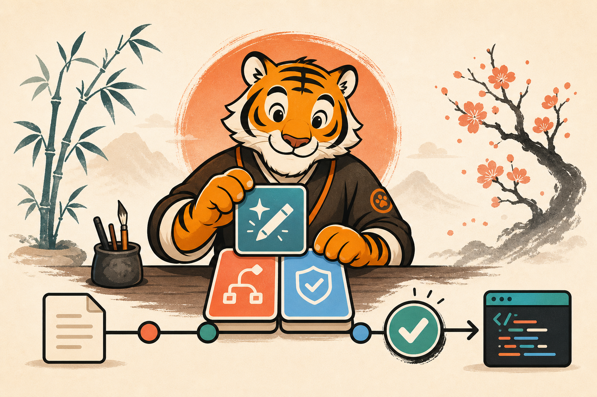

# TigerKit

<p align="center">
  
</p>

TigerKit 21.0.10은 Claude Code, Codex, Hermes Agent용 엔지니어링 Agent Skills
모음입니다. 중앙 workflow runtime이나 plugin 없이 14개 self-contained skill을
`npx skills`로 배포합니다. 최신 immutable snapshot은 `v21.0.10`이며 `main`에는
다음 릴리스 변경이 포함될 수 있습니다.

## 설치

```bash
npx skills add MTGVim/tiger-kit \
  --global \
  --agent claude-code \
  --agent codex \
  --agent hermes-agent \
  --skill '*'
```

고정 snapshot:

```bash
npx skills add "MTGVim/tiger-kit#v21.0.10" \
  --global \
  --agent claude-code \
  --agent codex \
  --agent hermes-agent
```

최신 main 설치를 계속 따라가려면 GitHub source로 설치한 뒤 전역 update를
실행합니다.

```bash
npx skills update --global --yes
# 짧은 표기: npx skills update -g -y
```

`npx skills add .` 또는 로컬 경로 설치는 저장소 검증·개발용입니다. Skills CLI의
update lock에 원격 source로 추적되지 않으므로, 실제 사용자 설치에는
`MTGVim/tiger-kit`를 사용하세요. 고정 snapshot을 바꾸려면 원하는 tag로
`skills add`를 다시 실행합니다.

Claude Code와 Hermes Agent에서는 `/tk-implement`, Codex에서는
`$tk-implement` 또는 skill picker를 사용합니다.

## Skill 표면

| Skill | 호출 | 소유 범위 |
| --- | --- | --- |
| `tk-drive` | user | 명시 source를 결정·Ready spec·조건부 tickets·unit commits·aggregate verification·finalization까지 진행 |
| `tk-ask-repo` | user | repository 질문을 `path:line` 근거로 조사하는 read-only desk |
| `tk-adhd` | user | 현재 응답 하나를 action-first 형태로 정리하는 one-shot utility |
| `tk-grill-me` | hybrid | material user decision을 evidence-first 질문 하나씩 닫음 |
| `tk-to-spec` | hybrid | 독립 구현 가능한 Ready R/AC spec 작성 |
| `tk-to-tickets` | hybrid | Ready spec을 독립 검증 가능한 vertical units로 분해 |
| `tk-implement` | hybrid | unit 하나를 구현·테스트·review하고 verified commit 하나 생성 |
| `tk-prototype` | hybrid | 폐기 가능한 UI/logic 비교물을 실행 |
| `tk-browser-verify` | hybrid | 실제 browser UI·network·최종 상태 검증 |
| `tk-skill-diagnose` | hybrid | 관찰된 Agent Skill incident를 재현·격리하고 verified `learn-ready` objective를 handoff |
| `tk-learn` | hybrid | `create | improve | merge`를 유일하게 소유하는 repository/user skill 작성자; 승인 전에는 쓰지 않음 |
| `tk-grooming` | hybrid | 기존 repository/user skill의 중복·범위·배치를 감사 |
| `tk-handoff` | hybrid | 현재 evidence 기반 resume snapshot 작성·재개 |
| `tk-merge-conflict` | hybrid | 진행 중인 Git conflict의 의도를 복원하고 operation 완료 |

작은 수정과 일반 후속 피드백은 skill 없이 현재 대화에서 처리합니다. 별도 artifact,
commit, 검증 또는 안전 경계가 있을 때만 해당 skill을 선택합니다.

## `tk-drive`

```text
explicit tk-drive <source>
→ material decision이 있을 때만 tk-grill-me
→ tk-to-spec
→ 여러 독립 unit일 때만 tk-to-tickets
→ unit마다 tk-implement + verified commit
→ aggregate verification
→ 필요할 때 tk-browser-verify
→ tk-drive finalization
```

`tk-learn`만 `create | improve | merge` skill 변경을 작성합니다.
`tk-skill-diagnose`는 검증된 목표를 `learn-ready`로 handoff하고,
`tk-grooming`은 repository/user skill만 감사하며 rule lifecycle을 소유하지
않습니다. `tk-browser-verify`는 Guard와 Verdict 모두 실제 이미지 검사를 거친
스크린샷과 가능한 경우 `Evidence directory: /absolute/path/...`를 남깁니다.

Continuation은 prompt-directed이며 durable scheduler나 cross-turn replay를
보장하지 않습니다. Process 또는 host 경계를 넘으면 `.tigerkit/` artifact,
Git, tests, browser evidence를 다시 읽어 다음 node를 선택합니다.

TigerKit은 이 한계를 문구로 숨기지 않습니다. `scripts/run_drive_experiment.py`는
동일한 source를 `tk-drive` arm과 명시 phase composition arm으로 실행하여 terminal
상태, phase continuation, commit, verification, token/time을 비교합니다. 측정된
명확한 열세가 없으면 catalog에서 `tk-drive`를 자동 삭제하지 않습니다.

## Eval single source of truth

각 package가 자신의 executable 계약을 소유합니다.

```text
skills/<skill>/evals/triggers.json  trigger SSOT
skills/<skill>/evals/evals.json     behavior SSOT
evals/catalog-routing.json          cross-skill routing SSOT
evals/release-critical.json         release quality subset
evals/drive-ab.json                  drive A/B scenarios
```

생성된 `test-prompts.json`, root trigger/behavior 복제 fixture, Darwin projection
동기화 단계는 없습니다. `scripts/validate_skills.py`는 `skills/tk-*`를 자동
발견하고 canonical JSON schema, mechanical assertions, host metadata, links,
release-critical references를 직접 검증합니다.

## 로컬 검증

```bash
python3 scripts/validate_skills.py
python3 scripts/validate_skills.py --links-only
python3 -m unittest discover -s scripts -p 'test_*.py'
python3 scripts/audit_catalog.py --check
npx --yes skills@1.5.9 add . --list
npx --yes skills add . --list
git diff --check
```

Release gate:

```bash
python3 scripts/run_release_gate.py \
  --baseline v21.0.10 \
  --candidate HEAD \
  --output /tmp/tigerkit-release-gate
```

Live quality는 built-in adapter가 `Codex → Claude Code → Hermes Agent` 순서로
설치 여부와 비대화형 실행을 시도하고 첫 complete pass에서 멈춥니다. 실행기,
인증 또는 안정적인 결과가 없으면 `quality.status: Advisory`로 남기되 deterministic
validator·test·package 실패와 혼동하지 않습니다. `--adapter-command`는 custom
adapter override용입니다.

Drive 비교 실험:

```bash
python3 scripts/run_drive_experiment.py \
  --candidate HEAD \
  --output /tmp/tigerkit-drive-ab
```

## State와 권한

`.tigerkit/`은 repo/worktree-local scratch이며 영구 project 문서나 전역 상태가
아닙니다. TigerKit은 consumer `.gitignore`를 수정하지 않습니다.

`tk-learn`은 reusable skill의 `create | improve | merge`를 유일하게 소유합니다.
Evidence, dedupe, trigger/eval, baseline/compatibility gate를 먼저 검증하고,
현재 turn의 명시적 apply 승인이 있기 전에는 canonical skill path를 쓰지 않습니다.
`tk-skill-diagnose`와 `tk-grooming`은 `tk-learn`용 proposal만 만들며 자동 invoke하지
않습니다.

`tk-implement`와 `tk-drive`의 명시 호출은 문서화된 current-branch commit까지만
허용합니다. Push, PR, merge, tag, release, publish는 별도 명시 권한 없이는
수행하지 않습니다.

Git tag가 immutable version source of truth입니다. Release 준비·PR·annotated tag·
peeled SHA verification은 private maintainer repository의 `tigerkit-release`와
idempotent release driver가 소유하며 GitHub Actions는 사용하지 않습니다.

TigerKit 20.1.2 이하에서 갱신한다면 [MIGRATION.md](MIGRATION.md)를 읽으세요.
Attribution은 [NOTICE.md](NOTICE.md)에 보존됩니다.
